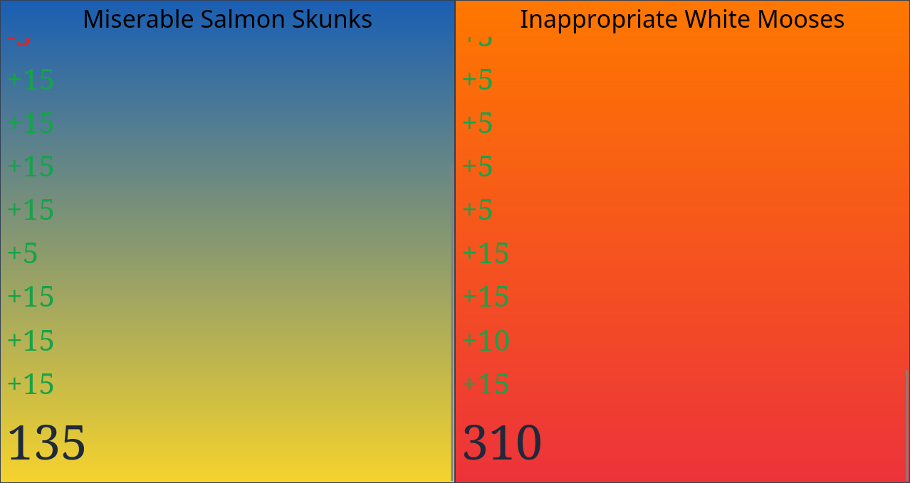

# Quizbowl Score

##### (qbs)

A match scoring system based on [Lancaster-Lebanon Quiz Bowl League](https://www.qbwiki.com/wiki/Lancaster-Lebanon_League) format, but could probably be used for quite a bit more too.

## Screenshots

*gradients are customized per team*

## Development

This project uses the [t3 stack](https://create.t3.gg): next.js, tailwindcss, prisma, and trpc (all with typescript of course).

- Get started by cloning the repo
- `cd` into it and run `pnpm install`, or the similar command of some other package manager
- Create your `.env` file, and fill in the values following `.env.example` as an example. You'll need a google account and a postgresql server.
- Run `pnpm dev` (or again a similar command for your package manager) to start the development server
- Open `localhost:3000`
- Get to work!
